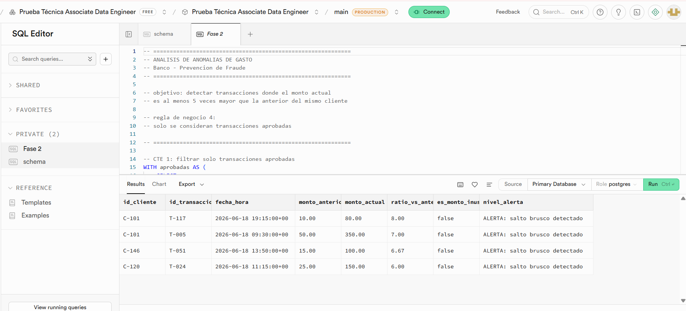
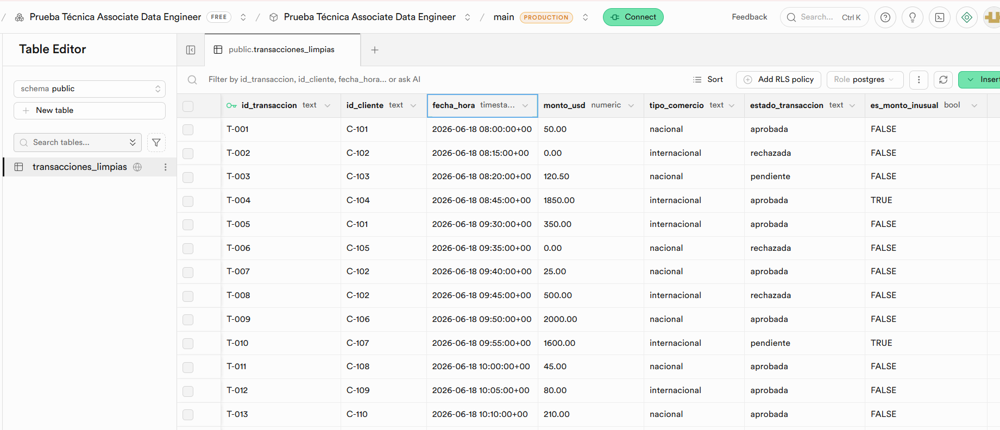

#  Pipeline de Detección de Anomalías de Fraude

## Descripción

Este proyecto implementa un pipeline ETL para procesar un archivo diario de transacciones de tarjetas de crédito.

El objetivo es limpiar la información recibida, aplicar las reglas de negocio proporcionadas, almacenar los datos en una base de datos PostgreSQL mediante Supabase y realizar una consulta SQL para detectar posibles anomalías de gasto.

---
## Integrante

Daniella Marissa Navarro Araniva

Repositorio:  

https://github.com/Maxrissa/Prueba_Tecnica_Associate_Data_Engineer

---

# Fase 1 - Diseño del flujo de datos

## Importancia de la calidad de datos

En un sistema de deteccion de fraude, la calidad de los datos es critica ya que errores pueden generar alertas incorrectas.

### Eliminacion de duplicados
Se eliminan registros duplicados usando `id_transaccion` como clave unica.

### Tratamiento de nulos
Los valores nulos en `monto_usd` se reemplazan por 0 cuando la transaccion es rechazada.

### Clasificacion de montos inusuales
Se crea la variable `es_monto_inusual` que identifica transacciones internacionales mayores a 1500 USD.

### Filtrado de analisis
Solo se consideran transacciones aprobadas para evitar datos innecesarios en el analisis.

---

# Arquitectura del pipeline

```text
                 transacciones_diarias.csv
                           │
                           ▼
                Extracción (Python + Pandas)
                           │
                           ▼
                  Transformación de datos
                  • Eliminar duplicados            
                  • Corregir valores nulos         
                  • Crear es_monto_inusual         
          
                           │
                           ▼
             Carga en Supabase (PostgreSQL)
                           │
                           ▼
        Consulta SQL (CTEs + Window Functions)
                           │
                           ▼
          Detección de anomalias de gasto
```

## Tecnologías utilizadas

- Python
- Pandas
- Supabase
- PostgreSQL
- SQL
- Parquet

---

# Estructura del proyecto

```text
Prueba_Tecnica_Associate_Data_Engineer/

├── data/
│   └── transacciones_diarias.csv
│
├── src/
│   ├── pipeline.py
│   └── cargar_supabase.py
│
├── sql/
│   ├── schema.sql
│   └── consulta_anomalias.sql
│
├── airflow/
│   └── dag_transacciones.py
│
├── images/
│   ├── consulta_sql.png
│   └── transacciones_limpias.png
│
├── requirements.txt
│
└── README.md
```

---

# Ejecución del proyecto

## 1. Instalamos las dependencias

```bash
pip install -r requirements.txt
```

## 2. Configuramos Supabase

1. Creamos un proyecto en Supabase: Prueba Técnica Associate Data Engineer
2. Obtenemos las credenciales de conexión.
3. Creamos el archivo `.env` con las variables de SUPABASE_URL y SUPABASE_KEY.

## 3. Creamos la tabla

Desde el **SQL Editor** de Supabase ejecutamos el contenido del archivo:

```text
sql/schema.sql
```
## 4. Ejecutamos el pipeline

```bash
python src/pipeline.py
```

El pipeline ETL realiza el procesamiento completo de las transacciones siguiendo reglas de negocio definidas para deteccion de fraude:

- Ingiere el archivo CSV de transacciones diarias como fuente de datos.
- Aplica limpieza de datos eliminando registros duplicados utilizando `id_transaccion` como clave unica.
- Corrige valores nulos en `monto_usd` cuando la transaccion es rechazada, asignando un valor de 0.0.
- Genera la variable `es_monto_inusual` para identificar transacciones internacionales mayores a 1500 USD.
- Persisten los datos procesados en una tabla de PostgreSQL (Supabase) para su posterior analisis.

## 5. Ejecutamos la consulta SQL

Abrimos el **SQL Editor** de Supabase y ejecutamos:

```text
sql/consulta_anomalias.sql
```

La consulta utiliza **CTEs** y la función **LAG()** para comparar cada transacción aprobada con la inmediatamente anterior del mismo cliente e identificar aquellas cuyo monto sea al menos cinco veces mayor.

---

# Orquestación con Apache Airflow

El archivo `dag_transacciones.py` contiene la propuesta de automatización del pipeline.

La ejecución está programada para todos los días a las **11:30 PM**.

Flujo de ejecución:

```text
Transformación
      │
      ▼
Carga a Supabase
      │
      ▼
Consulta SQL
```

Cada tarea depende de que la anterior finalice correctamente.

---
# Modelo de datos

Para este proyecto se utilizo una unica tabla (`transacciones_limpias`) que concentra todo el proceso de transformacion y facilita la implementacion del pipeline.

En un entorno productivo, se recomienda la implementacion de un modelo dimensional en esquema estrella para optimizar el analisis y la escalabilidad del sistema:

- **Fact_Transacciones**: tabla principal con los hechos transaccionales (montos, estados, fechas).
- **Dim_Cliente**: dimension con informacion descriptiva de los clientes.
- **Dim_Fecha**: dimension de tiempo para analisis temporal.
- **Dim_Comercio**: dimension que clasifica el tipo de comercio.

Aplicarlo permite mejorar el rendimiento de las consultas analiticas y facilita la construccion de dashboards y modelos de deteccion de fraude.

---
# Evidencia
## Consulta SQL en Supabase



---

## Datos cargados en tabla transacciones_limpias


---
